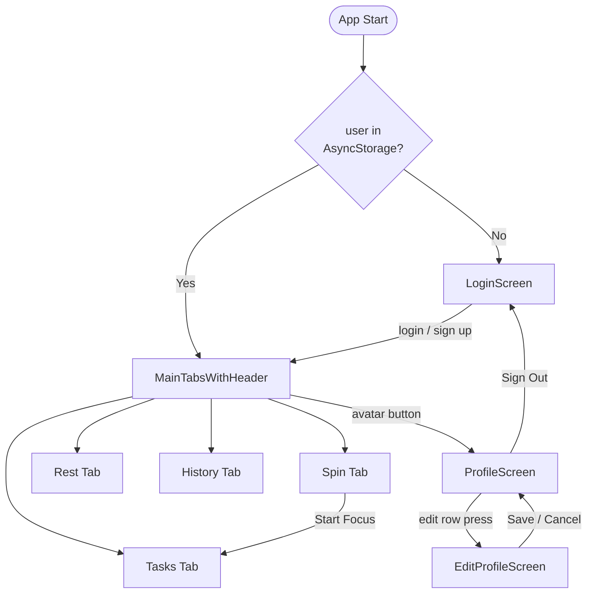
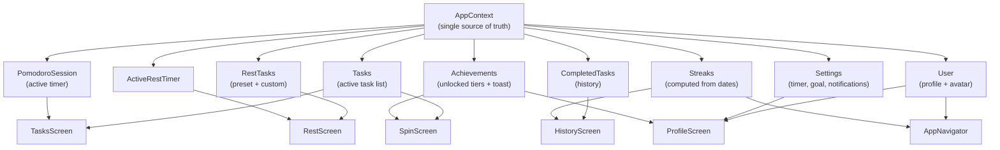
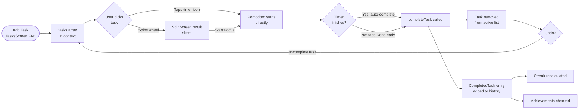
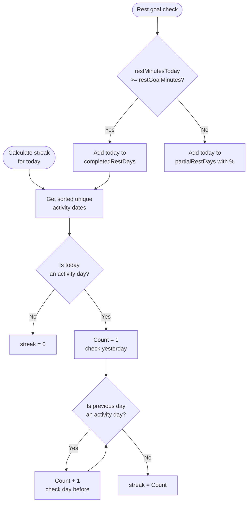
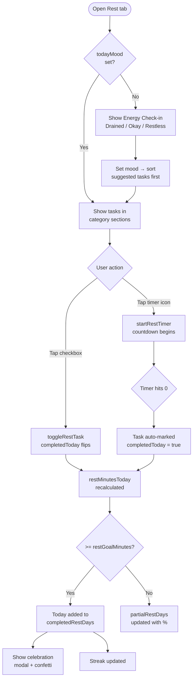
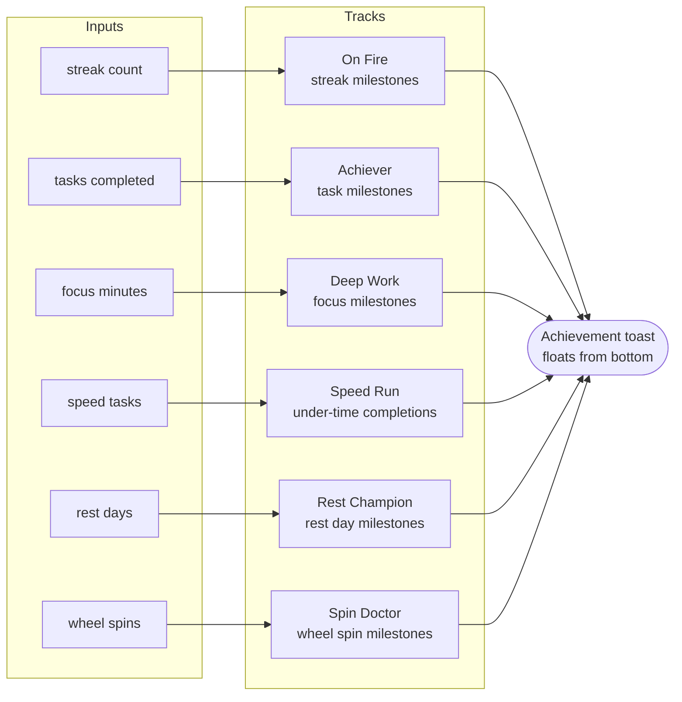
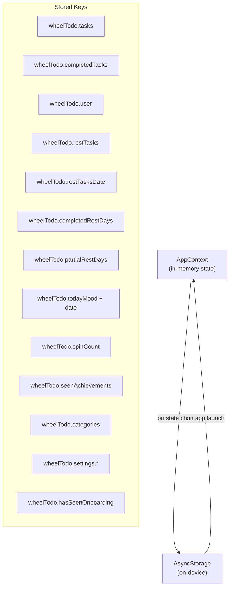

# Architecture

Technical overview of WheelTodo's structure, navigation, data flow, and key logic paths.

---

## Table of Contents

- [Navigation Structure](#navigation-structure)
- [Screen Flow](#screen-flow)
- [State Architecture](#state-architecture)
- [Task Lifecycle](#task-lifecycle)
- [Streak Logic](#streak-logic)
- [Rest Mode Flow](#rest-mode-flow)
- [Achievement System](#achievement-system)
- [Data Persistence](#data-persistence)

---

## Navigation Structure

WheelTodo uses two nested navigators from React Navigation v6.

```
Root (Native Stack)
├── MainTabs  ← default
│   ├── Spin       (RotateCcw icon)
│   ├── Tasks      (ListTodo icon)
│   ├── Rest       (Moon icon)
│   └── History    (Clock icon)
├── Profile   (push, headerShown: false)
└── EditProfile (push, headerShown: false)
```

The header bar (streak badge + avatar button) is rendered **outside** the native stack header in a custom `MainTabsWithHeader` component. This avoids iOS `UIBarButtonItem` styling constraints.

```
LoginScreen          (shown when user === null)
     │
     ▼ login()
MainTabsWithHeader   (always mounted while user !== null)
├── Custom header bar  ←  streak badge + avatar press → Profile
└── MainTabs (bottom tabs)
```

---

## Screen Flow



---

## State Architecture

All app state lives in a single `AppContext` (React Context + `useState`). There is no Redux, Zustand, or external store. The context is provided at the root in `App.tsx` and consumed in every screen.



**Key design decisions:**
- Streaks are **computed** from raw date arrays (`completedTasks` and `completedRestDays`) — never stored as a number, so they can never go stale.
- Achievements are **computed** from `achievementValues` (a derived object of counts) — unlocking is automatic and idempotent.
- The Pomodoro timer is driven by a `setInterval` in `TasksScreen` that calls `tickPomodoro()` every 1 000 ms. The timer state itself lives in context.

---

## Task Lifecycle



---

## Streak Logic

A streak day is any calendar day where the user either:
- Completed at least one task (`completedTasks`), **or**
- Hit their rest goal (`completedRestDays`)



**Rest goal tiers:**

| Tier | Minutes |
|------|---------|
| Easy | 15 |
| Standard | 30 (default) |
| Dedicated | 45 |

---

## Rest Mode Flow



**Daily reset:** On app launch, if the stored `restTasksDate` differs from today, all `completedToday` flags are reset to `false`. Custom tasks are preserved; preset tasks reload from `PRESET_REST_TASKS`.

---

## Achievement System

Six achievement tracks, each with 3–4 tiers. Tiers unlock automatically when the threshold is crossed and fire a toast notification once.



| Track | Tiers |
|-------|-------|
| On Fire (streak) | Spark (3) · Blazing (7) · Inferno (30) · Eternal (100) |
| Achiever (tasks) | First Step (1) · Momentum (10) · Achiever (50) · Century (100) |
| Deep Work (focus min) | Focused (60) · In The Zone (300) · Deep Work (600) · Flow State (3 000) |
| Speed Run (on-time) | Quick Fix (1) · Sprinter (5) · Road Runner (20) |
| Rest Champion (rest days) | Day Off (1) · Balanced (7) · Zen Master (30) |
| Spin Doctor (spins) | First Spin (1) · Spin Doctor (10) · Wheel of Fortune (50) |

---

## Data Persistence

Everything is stored locally in AsyncStorage. There is no backend or cloud sync in the current version.



**Write strategy:** State is persisted in `useEffect` hooks that watch each slice of state. There is no debouncing — writes are immediate on every state change.

**Read strategy:** All keys are loaded in a single `AsyncStorage.multiGet` call on app boot. The app shows a loading state until this resolves.
